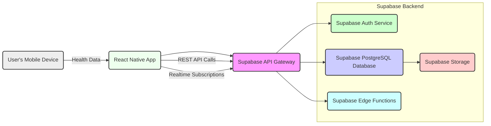

# Technical Document: Mylera - Health and Fitness Tracking Application

## 1. Overview

Mylera is a mobile application built with React Native and Supabase designed to encourage users to track their health metrics and engage in friendly competition through leaderboards. The application allows users to:

*   **User Registration and Authentication:** Users can create accounts and securely log in using email and password.
*   **Profile Management:** Users can create and manage their profiles, including display names, avatar uploads, device type selection (OS native or Fitbit), and measurement system preference (metric or imperial). Users can also control the public visibility of their profiles.
*   **Health Metric Tracking:** The app integrates with native health platforms (Apple HealthKit, Google Health Connect) and Fitbit to collect health data such as steps, distance, calories burned, heart rate, exercise time, and flights climbed.
*   **Daily and Weekly Score Calculation:**  Collected health metrics are processed to calculate daily and weekly scores based on predefined goals and performance.
*   **Dynamic Leaderboards:**  The application features daily and weekly leaderboards that dynamically rank users based on their calculated scores, fostering a competitive and engaging environment.
*   **Data Visualization:** Users can view their historical health data through interactive charts and dashboards, providing insights into their progress over time.

## 2. Architecture

The Mylera system follows a client-server architecture, with a React Native front-end application interacting with a Supabase backend.

**Components and Data Flow:**

1.  **React Native App (Client):**
    *   Developed using Expo and React Native, handles user interface, user interactions, and data presentation.
    *   Utilizes Expo modules for device features, including `expo-health-connect`, `expo-image-picker`, and `expo-secure-store`.
    *   Communicates with the Supabase backend via REST APIs for data fetching and updates.
    *   Subscribes to Supabase Realtime channels for leaderboard updates.
    *   Integrates with native health APIs (Health Connect, HealthKit) and Fitbit API through providers for health data collection.

2.  **Supabase Backend:**
    *   **Supabase Auth Service:** Manages user authentication, registration, login, and session management. Implements Row-Level Security (RLS) for data access control.
    *   **Supabase PostgreSQL Database:** Stores application data, including user profiles, health metrics, daily and weekly totals, and leaderboard information. Includes functions and triggers for data processing and automation.
    *   **Supabase Storage:**  Stores user avatars and other assets.
    *   **Supabase Edge Functions:**  Used for server-side logic, specifically for handling Fitbit OAuth token exchange and refresh, enhancing security and managing API keys outside the client application.
    *   **Supabase API Gateway:**  Provides a unified endpoint for client applications to interact with Supabase services, managing API requests and routing.

3.  **Data Flows:**
    *   **User Authentication:**  The React Native app interacts with Supabase Auth for user sign-up, sign-in, and session management. Upon successful authentication, Supabase provides JWT tokens for secure API requests.
    *   **Profile Data Management:** User profile information (display name, avatar, settings) is stored and retrieved from the `user_profiles` table in the Supabase database via API calls from the React Native app. Profile updates are also sent through API requests.
    *   **Health Data Capture:**
        *   The React Native app uses platform-specific health providers (`src/providers/health`) to fetch health data from device sensors or connected services (Fitbit).
        *   Data is normalized and aggregated within the React Native app and then sent to the Supabase backend via API calls to store in the `connect.health_data` and `public.daily_metric_scores` tables.
    *   **Score Calculation:**
        *   Database functions (`calculate_metric_points`, `update_metric_scores_trigger`) in Supabase automatically calculate metric points and update `daily_metric_scores` table upon data insertion or update.
        *   Triggers (`update_weekly_totals_trigger`) automatically compute and update `daily_totals` and `weekly_totals` based on `daily_metric_scores`.
    *   **Leaderboard Updates:**
        *   The React Native app fetches leaderboard data from the `daily_totals_with_rank` and `weekly_totals` views via API calls.
        *   Supabase Realtime subscriptions on `daily_totals` and `weekly_totals` tables push real-time updates to connected clients whenever leaderboard data changes, ensuring near real-time leaderboard updates in the app.
    *   **Fitbit Integration:**
        *   React Native app initiates Fitbit OAuth flow using `expo-auth-session`.
        *   OAuth code is exchanged for tokens using the `fitbit-token-exchange` Supabase Edge Function.
        *   Tokens are securely stored in the React Native app using `expo-secure-store`.
        *   `fitbit-token-refresh` Supabase Edge Function is used to refresh access tokens when they expire.

## 3. Data Model

The data model is designed to efficiently store and manage user profiles, health metrics, and leaderboard data within the Supabase PostgreSQL database.

### 3.1. Tables

*   **`auth.users` (Supabase Auth):**  Manages user authentication credentials.
    *   `id` (UUID, Primary Key): User ID, automatically generated by Supabase Auth.
    *   `email` (Text): User's email address.
    *   `encrypted_password` (Text): Hashed password.
    *   ... (Other standard auth fields)

*   **`public.user_profiles`:** Stores user-specific profile information.
    *   `id` (UUID, Primary Key, Foreign Key to `auth.users.id`): User ID, linking to authentication.
    *   `display_name` (Text, Nullable): User's display name, defaults to "User" + random string if null.
    *   `avatar_url` (Text, Nullable): URL for the user's avatar image.
    *   `show_profile` (Boolean, Default `false`):  Flag to control profile visibility on leaderboards.
    *   `created_at` (Timestamp with Time Zone, Default `now()`): Timestamp of profile creation.
    *   `updated_at` (Timestamp with Time Zone, Default `now()`): Timestamp of last profile update.
    *   `device_type` (Text, Check Constraint `user_profiles_device_type_check`): Type of device used to track metrics ('OS', 'fitbit').
    *   `measurement_system` (Text, Check Constraint `user_profiles_measurement_system_check`): Preferred measurement system ('imperial', 'metric').

*   **`connect.health_data`:** Stores raw health data collected from devices.
    *   `id` (UUID, Primary Key, Default `uuid_generate_v4()`): Unique ID for each health data entry.
    *   `user_id` (UUID, Not Null, Foreign Key to `auth.users.id`): User associated with the health data.
    *   `date` (Date, Not Null): Date of the health data record.
    *   `health_metric` (Text, Not Null): Type of health metric (e.g., 'steps', 'distance').
    *   `value` (Numeric, Not Null): Raw value of the health metric.
    *   `created_at` (Timestamp with Time Zone, Default `now()`): Timestamp of data entry creation.
    *   `updated_at` (Timestamp with Time Zone, Default `now()`): Timestamp of last data entry update.
    *   **Indexes:** `idx_health_data_user_date` (btree index on `user_id`, `date`)

*   **`public.daily_metric_scores`:** Stores daily scores for each metric type for each user.
    *   `id` (UUID, Primary Key, Default `uuid_generate_v4()`): Unique ID for each daily metric score.
    *   `user_id` (UUID, Not Null, Foreign Key to `auth.users.id`): User associated with the metric score.
    *   `date` (Date, Not Null, Default `current_date`): Date of the metric score.
    *   `metric_type` (Text, Not Null, Check Constraint `valid_metric_type`): Type of health metric (e.g., 'steps', 'calories').
    *   `goal_reached` (Boolean, Default `false`): Flag indicating if the user reached the daily goal for this metric.
    *   `points` (Integer, Default `0`): Points earned for this metric on this day.
    *   `created_at` (Timestamp with Time Zone, Default `now()`): Timestamp of score creation.
    *   `updated_at` (Timestamp with Time Zone, Default `now()`): Timestamp of last score update.
    *   `value` (Numeric, Nullable, Check Constraint `positive_values`): Value of the metric for the day.
    *   `goal` (Numeric, Nullable): Daily goal for the metric.
    *   `is_test_data` (Boolean, Default `false`): Flag to identify test data, used for RLS policies.
    *   **Constraints:** `unique_daily_metric` (Unique constraint on `user_id`, `date`, `metric_type`), `valid_metric_type`, `positive_values`
    *   **Indexes:** `idx_daily_metric_scores_user_date` (btree index on `user_id`, `date`)

*   **`public.daily_totals`:** Stores daily total scores and metrics completed for each user.
    *   `id` (UUID, Primary Key, Default `uuid_generate_v4()`): Unique ID for each daily total.
    *   `user_id` (UUID, Not Null, Foreign Keys to `auth.users.id` and `user_profiles.id`): User associated with the daily total.
    *   `date` (Date, Not Null, Default `current_date`): Date of the daily total.
    *   `total_points` (Integer, Default `0`): Total points accumulated for the day.
    *   `metrics_completed` (Integer, Default `0`): Number of metrics completed for the day.
    *   `created_at` (Timestamp with Time Zone, Default `now()`): Timestamp of daily total creation.
    *   `updated_at` (Timestamp with Time Zone, Default `now()`): Timestamp of last daily total update.
    *   `is_test_data` (Boolean, Default `false`): Flag to identify test data, used for RLS policies.
    *   **Constraints:** `unique_daily_total` (Unique constraint on `user_id`, `date`), `fk_user_profiles` (Foreign Key to `user_profiles.id`)
    *   **Indexes:** `idx_daily_totals_user_date` (btree index on `user_id`, `date`), `idx_daily_totals_date_points` (btree index on `date`, `total_points` DESC), `idx_daily_totals_date_points_user` (btree index on `date`, `total_points` DESC, `user_id`)

*   **`public.weekly_totals`:** Stores weekly total scores and metrics completed for each user.
    *   `id` (UUID, Primary Key, Default `uuid_generate_v4()`): Unique ID for each weekly total.
    *   `user_id` (UUID, Not Null, Foreign Key to `auth.users.id`): User associated with the weekly total.
    *   `week_start` (Date, Not Null): Start date of the week (typically Monday).
    *   `total_points` (Integer, Default `0`): Total points accumulated for the week.
    *   `metrics_completed` (Integer, Default `0`): Number of metrics completed during the week.
    *   `created_at` (Timestamp with Time Zone, Default `now()`): Timestamp of weekly total creation.
    *   `updated_at` (Timestamp with Time Zone, Default `now()`): Timestamp of last weekly total update.
    *   `is_test_data` (Boolean, Default `false`): Flag to identify test data, used for RLS policies.
    *   **Constraints:** `weekly_totals_user_id_week_start_key` (Unique constraint on `user_id`, `week_start`)

### 3.2. Functions

*   **`public.calculate_health_score(p_steps INTEGER, p_distance DOUBLE PRECISION, p_calories INTEGER, p_heart_rate INTEGER)`:** Calculates a health score based on input metrics.
    *   Input parameters: `p_steps`, `p_distance`, `p_calories`, `p_heart_rate`.
    *   Returns: `INTEGER` - calculated health score.
    *   Logic: Implements a weighted scoring system based on predefined thresholds for each metric.

*   **`public.calculate_metric_points(metric_value NUMERIC, metric_type TEXT, measurement_system TEXT)`:** Calculates points for a given metric value based on metric type and user's measurement system.
    *   Input parameters: `metric_value`, `metric_type`, `measurement_system`.
    *   Returns: `TABLE(points INTEGER, goal_reached BOOLEAN)` - points earned and goal reached status.
    *   Logic: Calculates points based on predefined rules for each metric type, considering measurement system conversions if needed.

*   **`public.check_auth_user_exists(user_id UUID)`:** Checks if a user exists in the `auth.users` table.
    *   Input parameter: `user_id`.
    *   Returns: `BOOLEAN` - `true` if user exists, `false` otherwise.
    *   Security Definer: Runs with the privileges of the function creator.

*   **`public.ensure_auth_user_exists()`:** Trigger function to ensure an auth user exists before creating a profile.
    *   Trigger type: `BEFORE INSERT OR UPDATE ON public.user_profiles`.
    *   Security Definer: Runs with the privileges of the function creator.
    *   Logic: Checks if `auth.users` record exists for the `user_id` being inserted or updated in `user_profiles`, raising an exception if not.

*   **`public.generate_default_display_name()`:** Trigger function to generate a default display name if not provided.
    *   Trigger type: `BEFORE INSERT ON public.user_profiles`.
    *   Logic: If `display_name` is NULL, sets it to 'User' + first 8 characters of a UUID.

*   **`public.get_metric_streaks(p_user_id UUID, p_metric_type TEXT, p_min_streak_length INTEGER DEFAULT 2)`:** Retrieves metric streaks for a user.
    *   Input parameters: `p_user_id`, `p_metric_type`, `p_min_streak_length` (default 2).
    *   Returns: `TABLE(streak_start DATE, streak_end DATE, streak_length INTEGER, is_active BOOLEAN)` - streak details.
    *   Logic: Calculates streaks based on consecutive days where the user reached the goal for a specific metric.

*   **`public.get_week_start(date_input DATE)`:** Returns the start date of the week for a given date.
    *   Input parameter: `date_input`.
    *   Returns: `DATE` - start date of the week.
    *   Logic: Uses `date_trunc('week', date_input)` to get the week start.

*   **`public.handle_new_user()`:** Trigger function to create a default user profile upon new user registration.
    *   Trigger type: `AFTER INSERT ON auth.users`.
    *   Logic: Inserts a new record into `public.user_profiles` with the new user's ID.

*   **`public.track_health_metric_changes()`:** Trigger function to track changes in `daily_metric_scores` table in a history table.
    *   Trigger type: `BEFORE INSERT OR UPDATE OR DELETE ON public.daily_metric_scores`.
    *   Security Definer: Runs with the privileges of the function creator.
    *   Logic: Creates history records in `public.health_metrics_history` table for INSERT, UPDATE, and DELETE operations, tracking changes, versions, and user actions.

*   **`public.update_daily_ranks(target_date DATE)`:** Function to update daily scores based on leaderboard ranking for a given date.
    *   Input parameter: `target_date`.
    *   Security Definer: Runs with the privileges of the function creator.
    *   Logic: Calculates daily ranks based on `daily_score` and updates `daily_score` based on rank position, implementing a tiered scoring system.

*   **`public.update_metric_points()`:** Trigger function to update `points` column in `daily_metric_scores` table.
    *   Trigger type: `BEFORE INSERT OR UPDATE ON public.daily_metric_scores`.
    *   Logic: Calculates `points` based on `value` and `goal` if both are not NULL.

*   **`public.update_metric_scores()`:** Trigger function to update `points` and `goal_reached` columns in `daily_metric_scores` using `calculate_metric_points` function.
    *   Trigger type: `BEFORE INSERT OR UPDATE OF value ON public.daily_metric_scores`.
    *   Logic: Calls `calculate_metric_points` to determine points and goal reached status based on `value`, `metric_type`, and user's `measurement_system`.

*   **`public.update_updated_at_column()`:** Trigger function to automatically update `updated_at` column on UPDATE operations.
    *   Trigger type: `BEFORE UPDATE ON various tables`.
    *   Logic: Sets `NEW.updated_at = now()`.

*   **`public.update_weekly_totals()`:** Trigger function to update `weekly_totals` table after changes in `daily_totals`.
    *   Trigger type: `AFTER INSERT OR UPDATE ON public.daily_totals`.
    *   Security Definer: Runs with the privileges of the function creator.
    *   Logic: Inserts or updates records in `weekly_totals` table, aggregating `total_points` and `metrics_completed` from `daily_totals` for the current week.

*   **`public.update_weekly_totals_trigger()`:** Placeholder trigger function for logging purposes (Notice message added in SQL dump).

### 3.3. Views

*   **`public.daily_totals_with_rank`:** View to include rank with daily totals.
    *   SELECT statement: `SELECT dt.*, rank() OVER (ORDER BY dt.total_points DESC) AS rank FROM public.daily_totals dt;`
    *   Purpose: Provides a ranked view of `daily_totals` for leaderboard display.

### 3.4. Relationships, Indexes, and Policies

*   **Relationships:**
    *   `user_profiles.id` is a one-to-one relationship with `auth.users.id`.
    *   `daily_metric_scores.user_id`, `daily_totals.user_id`, and `weekly_totals.user_id` are foreign keys referencing `auth.users.id`.
    *   `daily_totals.user_id` also has a foreign key to `user_profiles.id`.
    *   `connect.health_data.user_id` is a foreign key to `auth.users.id`.

*   **Indexes:** Indexes are created on `user_id` and `date` columns in `connect.health_data`, `daily_metric_scores`, and `daily_totals` tables for efficient querying, especially for leaderboard and user-specific data retrieval. Indexes also exist for sorting by `total_points` in `daily_totals` for leaderboard ranking.

*   **Row-Level Security (RLS) Policies:**  RLS is extensively used to control data access based on user roles and ownership. Key policies include:
    *   **`connect.health_data`:** "Users can access their own health data" - Allows users to SELECT and CHECK (modify) only their own health data (`auth.uid() = user_id`).
    *   **`public.weekly_totals`:** "Allow trigger to insert weekly totals" - Allows INSERT operations for triggers. "Users can modify their own weekly totals" and "Users can modify own weekly totals" - Allow users to MODIFY their own weekly totals (`auth.uid() = user_id`). "Users can read public weekly totals" and "Users can read their own weekly totals" and "Users can view weekly totals" - Control SELECT access based on user ownership and profile visibility.
    *   **`public.daily_metric_scores`:** "Users can delete their own metric scores", "Users can insert their own metric scores", "Users can modify own metric scores", "Users can read metric scores", "Users can read their own metric scores", "Users can update their own metric scores", "Users can update their own metric scores" - Control INSERT, SELECT, UPDATE, and DELETE operations, ensuring users can only manage their own metric scores, and access is controlled based on ownership and profile visibility.
    *   **`public.daily_totals`:** "Users can modify own daily totals", "Users can read daily totals" - Control MODIFY and SELECT operations, ensuring users can only manage their own daily totals, and access is controlled based on ownership and profile visibility.
    *   **`public.user_profiles`:** "Users can insert their own profile", "Users can modify own profile", "Users can read public profiles", "Users can read their own profile", "Users can update own profile", "Users can update their own profile", "Users can view public or own profiles" - Control INSERT, SELECT, and UPDATE operations, ensuring users can manage their own profiles and control public visibility.

## 4. Glossary

*   **Health Metric:**  A measurable aspect of a user's health and fitness, such as steps taken, distance traveled, calories burned, heart rate, exercise duration, basal metabolic rate, and flights climbed.
*   **Daily Score:** A numerical value computed daily for each user, reflecting their overall health activity level based on tracked health metrics. Calculated using `calculate_health_score` function.
*   **Daily Metric Score:** Score and goal completion status for a specific health metric on a given day, stored in `daily_metric_scores` table.
*   **Daily Totals:** Aggregated daily scores and metrics completed count for each user, stored in `daily_totals` table. Used for daily leaderboards.
*   **Weekly Totals:** Aggregated weekly scores and metrics completed count for each user, stored in `weekly_totals` table. Used for weekly leaderboards.
*   **Metric Type:** Categorization of health data being tracked (e.g., 'steps', 'calories', 'distance', 'heart_rate', 'exercise', 'basal_calories', 'flights_climbed').
*   **Points:** Numerical rewards assigned for achieving health metric goals or reaching certain thresholds, contributing to daily and weekly scores. Calculated by `calculate_metric_points` function.
*   **Goal:** Target value set for a health metric, used to determine goal completion and points allocation.
*   **Goal Reached:** Boolean status indicating whether a user has met or exceeded their daily goal for a specific health metric.
*   **Row-Level Security (RLS):**  A security feature in Supabase PostgreSQL that enables fine-grained control over data access at the row level, ensuring users can only access and modify data they are authorized to.
*   **Measurement System:** User preference for units of measurement, either 'metric' (kilometers, kilograms, etc.) or 'imperial' (miles, pounds, etc.).
*   **User Profile:** A collection of information about a user, including display name, avatar, privacy settings, and device preferences, stored in the `user_profiles` table.

## 5. Mapping

This section outlines how different parts of the codebase and database interact to deliver the application's functionality.

*   **User Registration and Profile Creation:**
    1.  User initiates registration in the React Native app (`app/(auth)/register.tsx`).
    2.  App sends registration request to Supabase Auth via `supabase.auth.signUp` (AuthProvider `register` function in `src/providers/AuthProvider.tsx`).
    3.  Supabase Auth creates a new user in `auth.users` table.
    4.  `handle_new_user()` trigger function in the database is activated, automatically creating a corresponding entry in `public.user_profiles` table with default settings.
    5.  User is automatically logged in after registration.

*   **Health Data Capture and Processing:**
    1.  User grants health permission to the app.
    2.  React Native app uses platform-specific health providers (`src/hooks/useHealthData.ts` and `src/providers/health`) to fetch health data (steps, distance, calories, etc.) from device's health platform (Apple HealthKit, Google Health Connect) or Fitbit API.
    3.  Fetched raw data is normalized and aggregated in the React Native app.
    4.  App calls `metricsService.updateMetric` (`src/services/metricsService.ts`) to send each metric value to the Supabase backend via API request.
    5.  On the Supabase backend, data is inserted/updated in `daily_metric_scores` table.
    6.  `update_metric_scores_trigger` function is activated, which calls `calculate_metric_points` function to calculate points and determine `goal_reached` status, updating the `daily_metric_scores` record.
    7.  `update_weekly_totals_trigger` function is activated after `daily_totals` is updated, recalculating weekly totals in `weekly_totals` table.

*   **Leaderboard Generation and Display:**
    1.  User navigates to the Leaderboard screen (`app/(app)/leaderboard/index.tsx`).
    2.  React Native app fetches leaderboard data using `leaderboardService.getDailyLeaderboard` or `leaderboardService.getWeeklyLeaderboard` (`src/services/leaderboardService.ts`) via API calls.
    3.  Supabase backend queries `daily_totals_with_rank` view (for daily leaderboard) or directly queries `weekly_totals` table (for weekly leaderboard), ordering results by `total_points` and applying RLS policies.
    4.  Leaderboard data is returned to the React Native app, which renders the leaderboard using `Leaderboard` and `LeaderboardEntry` components (`src/components/leaderboard`).
    5.  Real-time updates are handled via Supabase Realtime subscriptions (`ToggleableLeaderboard.tsx` in `src/components/leaderboard`), ensuring leaderboard data is updated dynamically in the app when changes occur in the database.

*   **Profile Management:**
    1.  User accesses the Profile screen (`app/(app)/profile/index.tsx`).
    2.  React Native app fetches user profile data using `leaderboardService.getUserProfile` (`src/services/leaderboardService.ts`) via API call.
    3.  Profile data is displayed in the `Profile` component (`src/components/profile/Profile.tsx`).
    4.  User edits profile information and saves changes.
    5.  React Native app calls `leaderboardService.updateUserProfile` (`src/services/leaderboardService.ts`) via API to update the `user_profiles` table in Supabase.

## 6. Additional Notes and Recommendations

Based on the codebase and architecture analysis, here are some recommendations for improvements:

*   **Performance:**
    *   **Database Indexing:** Review and optimize indexes, especially on tables involved in leaderboard queries (`daily_totals`, `weekly_totals`). Ensure indexes cover common query patterns (e.g., filtering by date, ordering by points, user ID).
    *   **Function Optimization:** Analyze performance of database functions, particularly `calculate_metric_points` and `calculate_health_score`, as these are called frequently. Consider query optimization and efficient algorithms within these functions.
    *   **Client-Side Caching:** Implement client-side caching for leaderboard data and user profiles to reduce API calls and improve app responsiveness, especially for frequently accessed data.
    *   **Data Aggregation Optimization:** For weekly totals, consider pre-aggregating data at the end of each day or week to reduce real-time calculation load and improve query performance.

*   **Concurrency and Scalability:**
    *   **Row-Level Security (RLS) Review:**  Thoroughly review and test all RLS policies to ensure they are correctly implemented and effectively prevent unauthorized data access, especially under concurrent user load.
    *   **Database Connection Pooling:** Ensure Supabase backend and Edge Functions are configured to use connection pooling to handle concurrent requests efficiently and prevent database connection exhaustion.
    *   **Rate Limiting:** Implement rate limiting on API endpoints to protect the backend from abuse and ensure fair usage under high concurrency.

*   **Maintainability and Code Quality:**
    *   **Code Modularity and Separation of Concerns:**  Maintain clear separation of concerns in both front-end and back-end code. Ensure components and services are modular and reusable.
    *   **Comprehensive Documentation:**  Expand documentation, especially for database functions, triggers, and RLS policies. Document API endpoints, data models, and key data flows for easier maintenance and onboarding of new developers.
    *   **Error Handling and Logging:** Implement robust error handling throughout the application, both client and server-side. Enhance logging for debugging and monitoring, especially for critical operations like data synchronization, score calculation, and leaderboard updates. Consider using structured logging for easier analysis.
    *   **Automated Testing:** Implement comprehensive unit and integration tests, particularly for core logic in services, providers, and database functions/triggers. Automated testing helps ensure code quality, prevent regressions, and facilitate easier refactoring and maintenance.

*   **Potential Refactoring:**
    *   **Centralized Configuration:** Centralize configuration settings (e.g., API endpoints, metric goals, scoring weights) in a configurable location (e.g., Supabase Config or dedicated configuration files) for easier management and adjustments.
    *   **Health Data Synchronization Strategy:** Review and refine the health data synchronization strategy. Consider background synchronization mechanisms (using background tasks or workers if needed, although Expo background tasks have limitations) to keep data fresh while minimizing battery drain and network usage.

By addressing these recommendations, the Mylera application can be further optimized for performance, scalability, security, and maintainability, ensuring a robust and engaging user experience.#  <#Title#>

