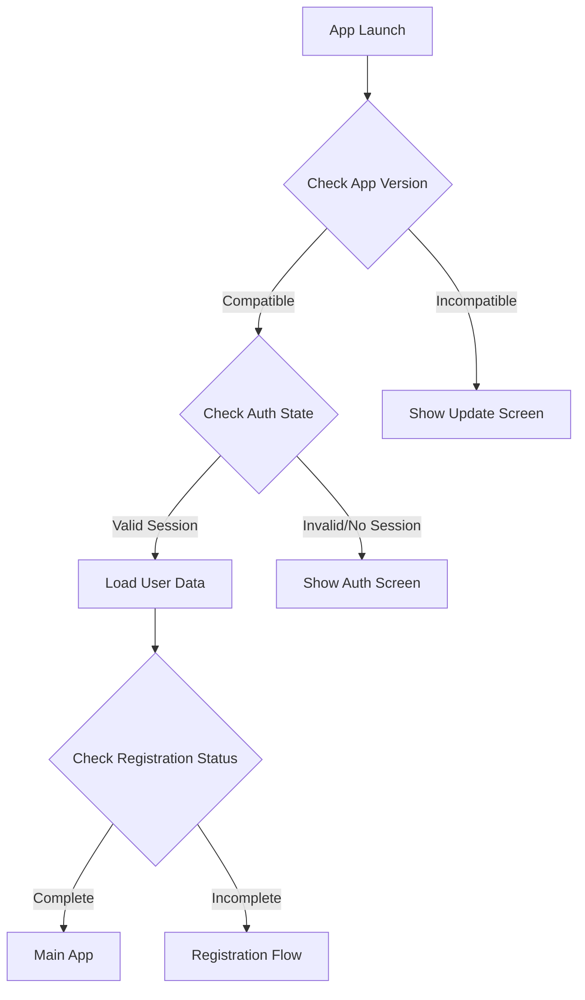

# Authentication System Design

## Context

The application needs a comprehensive authentication system that handles:
- Initial app launch validation
- Registration status verification
- App version compatibility
- Security protocols and logging
- Edge cases and legacy user migration

## Decision

We will implement a multi-layered authentication system with the following components:

### 1. App Launch Flow



### 2. Authentication Provider Structure

```typescript
interface AuthState {
  session: Session | null;
  user: User | null;
  registrationStatus: 'complete' | 'incomplete' | 'legacy';
  appVersion: string;
  lastSync: Date;
}

interface SecurityLog {
  timestamp: Date;
  event: string;
  userId?: string;
  details: Record<string, any>;
}
```

### 3. Security Layers

1. **Token Management**
   - JWT token validation
   - Refresh token rotation
   - Token expiration handling
   - Secure token storage

2. **Session Management**
   - Session timeout handling
   - Multiple device session handling
   - Session revocation capabilities
   - Session state persistence

3. **Version Control**
   - App version compatibility check
   - Forced update mechanism
   - API version compatibility
   - Migration path for legacy versions

### 4. Error Handling Strategy

1. **Network Errors**
   ```typescript
   interface NetworkError {
     type: 'network';
     code: number;
     retryable: boolean;
     lastAttempt: Date;
   }
   ```

2. **Authentication Errors**
   ```typescript
   interface AuthError {
     type: 'auth';
     code: string;
     message: string;
     action: 'retry' | 'reauth' | 'register';
   }
   ```

3. **Version Errors**
   ```typescript
   interface VersionError {
     type: 'version';
     currentVersion: string;
     requiredVersion: string;
     updateUrl: string;
   }
   ```

### 5. State Management

1. **Persistent Storage**
   - Secure credential storage
   - Session state persistence
   - User preferences
   - Version information

2. **Memory State**
   - Current session info
   - User context
   - App state
   - Network status

### 6. Migration Strategy

1. **Legacy User Migration**
   - Identify legacy users
   - Progressive migration path
   - Data preservation
   - Fallback mechanisms

2. **Version Migration**
   - Database schema updates
   - API compatibility layers
   - Client-side data migration
   - Rollback procedures

## Implementation Steps

1. **Initial Setup**
   - Implement version checking mechanism
   - Set up secure storage for credentials
   - Create logging infrastructure

2. **Authentication Flow**
   - Enhance AuthProvider with new capabilities
   - Implement token refresh logic
   - Add session management
   - Create security logging

3. **Error Handling**
   - Implement comprehensive error types
   - Add retry mechanisms
   - Create user feedback system
   - Set up error logging

4. **Migration Support**
   - Create legacy user detection
   - Implement migration workflows
   - Add data validation
   - Set up monitoring

5. **Security Enhancements**
   - Add token rotation
   - Implement session timeouts
   - Create security event logging
   - Add compromise detection

## Technical Details

### File Structure

```
src/
  auth/
    providers/
      AuthProvider.tsx
      SecurityProvider.tsx
      VersionProvider.tsx
    services/
      authService.ts
      migrationService.ts
      securityService.ts
    types/
      auth.types.ts
      security.types.ts
      version.types.ts
    utils/
      tokenUtils.ts
      migrationUtils.ts
      securityUtils.ts
```

### Key Components

1. **AuthProvider**
   - Manages authentication state
   - Handles token refresh
   - Coordinates with other providers

2. **SecurityProvider**
   - Manages security policies
   - Handles logging
   - Monitors for suspicious activity

3. **VersionProvider**
   - Checks app compatibility
   - Manages updates
   - Handles migrations

## Consequences

### Positive
- Robust security model
- Comprehensive error handling
- Clear migration path
- Improved monitoring
- Better user experience

### Negative
- Increased complexity
- More maintenance overhead
- Additional network requests
- Larger bundle size

## Status

Proposed

## References

- [JWT Best Practices](https://auth0.com/blog/jwt-security-best-practices/)
- [OAuth 2.0 Security](https://oauth.net/2/security-considerations/)
- [Mobile App Security Guidelines](https://owasp.org/www-project-mobile-security/)