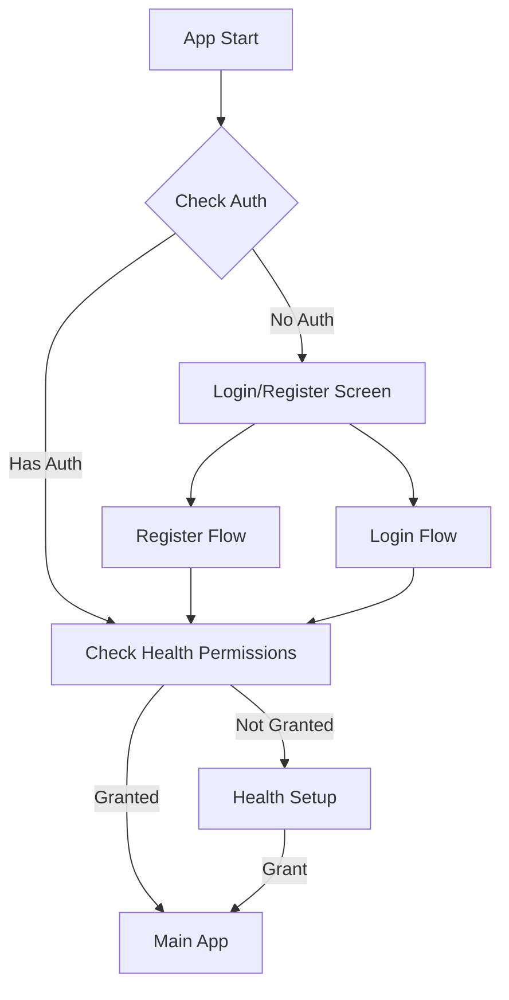

# Core Authentication and Data Flow Architecture

## Context

We need to implement a basic authentication flow that enables:
1. User registration and authentication
2. Health provider permission management
3. Native health metric retrieval
4. Supabase data storage and leaderboard functionality

## Decision

We will implement a streamlined authentication and data flow system focusing on core functionality.

### 1. Authentication Flow



### 2. Data Structure

```sql
-- Core tables needed in Supabase
CREATE TABLE user_profiles (
  id UUID PRIMARY KEY REFERENCES auth.users,
  display_name TEXT,
  show_profile BOOLEAN DEFAULT false,
  created_at TIMESTAMP WITH TIME ZONE DEFAULT timezone('utc'::text, now()),
  updated_at TIMESTAMP WITH TIME ZONE DEFAULT timezone('utc'::text, now())
);

CREATE TABLE health_metrics (
  id UUID PRIMARY KEY DEFAULT uuid_generate_v4(),
  user_id UUID REFERENCES auth.users NOT NULL,
  date DATE NOT NULL,
  steps INTEGER,
  distance FLOAT,
  calories INTEGER,
  heart_rate INTEGER,
  daily_score INTEGER,
  created_at TIMESTAMP WITH TIME ZONE DEFAULT timezone('utc'::text, now()),
  updated_at TIMESTAMP WITH TIME ZONE DEFAULT timezone('utc'::text, now()),
  UNIQUE(user_id, date)
);
```

### 3. Core Components

1. **AuthProvider**
   - Manages authentication state
   - Handles login/register
   - Tracks health permissions

2. **HealthProvider**
   - Requests native health permissions
   - Retrieves health metrics
   - Normalizes data across platforms

3. **LeaderboardService**
   - Fetches user rankings
   - Updates daily scores
   - Manages data visibility

### 4. Implementation Flow

1. **Registration Process**
```typescript
async function register(email: string, password: string) {
  // 1. Create auth user
  const { user } = await supabase.auth.signUp({ email, password });
  
  // 2. Create user profile
  await supabase.from('user_profiles').insert({
    id: user.id,
    display_name: null,
    show_profile: false
  });
  
  // 3. Route to health setup
  router.push('/(onboarding)/health-setup');
}
```

2. **Health Permission Flow**
```typescript
async function setupHealth(userId: string) {
  // 1. Request permissions
  const status = await healthProvider.requestPermissions();
  
  // 2. If granted, fetch initial metrics
  if (status === 'granted') {
    const metrics = await healthProvider.getMetrics();
    
    // 3. Store in Supabase
    await metricsService.updateMetrics(userId, metrics);
  }
  
  return status;
}
```

3. **Leaderboard Update**
```typescript
async function updateLeaderboard(userId: string) {
  // 1. Fetch today's metrics
  const metrics = await healthProvider.getMetrics();
  
  // 2. Calculate score
  const score = calculateDailyScore(metrics);
  
  // 3. Update database
  await supabase.from('health_metrics')
    .upsert({
      user_id: userId,
      date: new Date().toISOString().split('T')[0],
      ...metrics,
      daily_score: score
    });
}
```

### 5. Security Considerations

1. **Row Level Security**
```sql
-- User profiles visibility
CREATE POLICY "Public profiles are viewable by everyone"
  ON user_profiles FOR SELECT
  USING (show_profile = true OR auth.uid() = id);

-- Health metrics visibility
CREATE POLICY "Users can view their own metrics and public profiles' metrics"
  ON health_metrics FOR SELECT
  USING (
    auth.uid() = user_id 
    OR user_id IN (
      SELECT id FROM user_profiles 
      WHERE show_profile = true
    )
  );
```

2. **Permission Checks**
```typescript
function checkPermissions() {
  if (!session) return 'unauthorized';
  if (!healthPermissionStatus) return 'needs_setup';
  if (healthPermissionStatus === 'denied') return 'denied';
  return 'granted';
}
```

## Consequences

### Positive
- Clear, straightforward authentication flow
- Minimal data structure
- Basic security implementation
- Essential functionality only

### Negative
- Limited feature set
- Basic error handling
- Simple scoring system
- Manual permission management

## Implementation Steps

1. Set up Supabase tables and policies
2. Implement core AuthProvider functionality
3. Create health permission flow
4. Build basic leaderboard service
5. Add metric synchronization
6. Implement user profile management

## Status

Proposed

## References

- [Supabase Auth Documentation](https://supabase.com/docs/guides/auth)
- [HealthKit Documentation](https://developer.apple.com/documentation/healthkit)
- [Google Fit Documentation](https://developers.google.com/fit)