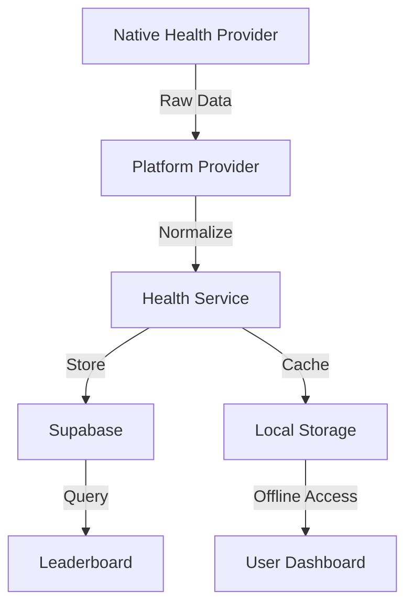

# Health Metrics Integration Strategy

## Context

The application needs to integrate with native health providers (Apple HealthKit and Google Fit) to retrieve user metrics, store them in Supabase, and use them for leaderboard rankings.

## Decision

We will implement a platform-agnostic health metrics system that normalizes data across different providers.

### 1. Health Provider Interface

```typescript
interface HealthProvider {
  // Core functionality
  initialize(): Promise<void>;
  requestPermissions(): Promise<PermissionStatus>;
  getMetrics(): Promise<HealthMetrics>;
  
  // Permission management
  checkPermissionsStatus(): Promise<PermissionState>;
  handlePermissionDenial(): Promise<void>;
  
  // Optional cleanup
  cleanup?(): Promise<void>;
}
```

### 2. Metric Types and Normalization

```typescript
interface HealthMetrics {
  steps: number | null;
  distance: number | null;  // meters
  calories: number | null;  // kcal
  heart_rate: number | null;  // bpm
  date: string;  // YYYY-MM-DD
}

// Platform-specific raw data
interface RawHealthData {
  steps?: RawHealthMetric[];
  distance?: RawHealthMetric[];
  calories?: RawHealthMetric[];
  heart_rate?: RawHealthMetric[];
}

// Normalized metric format
interface NormalizedMetric {
  timestamp: string;
  value: number;
  unit: string;
  type: MetricType;
}
```

### 3. Data Flow



### 4. Implementation Strategy

1. **Platform Detection**
```typescript
class HealthProviderFactory {
  static getProvider(): HealthProvider {
    if (Platform.OS === 'ios') {
      return new AppleHealthProvider();
    } else if (Platform.OS === 'android') {
      return new GoogleHealthProvider();
    }
    throw new Error('Unsupported platform');
  }
}
```

2. **Data Synchronization**
```typescript
class HealthService {
  async syncMetrics(userId: string): Promise<void> {
    // Get last sync timestamp
    const lastSync = await this.getLastSyncTime();
    
    // Fetch new data
    const provider = HealthProviderFactory.getProvider();
    const metrics = await provider.getMetrics(lastSync);
    
    // Store in Supabase
    await this.storeMetrics(userId, metrics);
    
    // Update sync timestamp
    await this.updateLastSyncTime();
  }
}
```

3. **Score Calculation**
```typescript
function calculateDailyScore(metrics: HealthMetrics): number {
  const weights = {
    steps: 0.4,
    distance: 0.2,
    calories: 0.2,
    heart_rate: 0.2
  };

  let score = 0;
  
  if (metrics.steps) {
    score += (metrics.steps / 10000) * weights.steps * 100;
  }
  if (metrics.distance) {
    score += (metrics.distance / 5000) * weights.distance * 100;
  }
  // ... similar calculations for other metrics
  
  return Math.round(Math.min(score, 100));
}
```

### 5. Error Handling

```typescript
class HealthProviderError extends Error {
  constructor(
    public provider: string,
    message: string,
    public code?: string
  ) {
    super(message);
    this.name = 'HealthProviderError';
  }
}

async function handleHealthError(error: unknown): Promise<void> {
  if (error instanceof HealthProviderError) {
    switch (error.code) {
      case 'permission_denied':
        await handlePermissionDenial();
        break;
      case 'not_available':
        await handleProviderUnavailable();
        break;
      default:
        logError(error);
    }
  }
}
```

### 6. Caching Strategy

```typescript
interface CacheConfig {
  maxAge: number;  // milliseconds
  priority: 'high' | 'low';
}

const CACHE_CONFIG: Record<MetricType, CacheConfig> = {
  steps: { maxAge: 5 * 60 * 1000, priority: 'high' },
  distance: { maxAge: 5 * 60 * 1000, priority: 'high' },
  calories: { maxAge: 15 * 60 * 1000, priority: 'low' },
  heart_rate: { maxAge: 15 * 60 * 1000, priority: 'low' }
};
```

## Implementation Steps

1. **Platform Integration**
   - Implement Apple HealthKit provider
   - Implement Google Fit provider
   - Create factory class

2. **Data Management**
   - Set up metric normalization
   - Implement caching system
   - Create sync service

3. **Error Handling**
   - Define error types
   - Implement recovery strategies
   - Add logging

4. **Testing**
   - Unit tests for calculations
   - Integration tests with providers
   - Error scenario testing

## Consequences

### Positive
- Consistent data format across platforms
- Efficient caching and syncing
- Clear error handling
- Platform-agnostic interface

### Negative
- Additional complexity in normalization
- Potential sync conflicts
- Platform-specific edge cases
- Cache management overhead

## Status

Proposed

## References

- [Apple HealthKit Documentation](https://developer.apple.com/documentation/healthkit)
- [Google Fit REST API](https://developers.google.com/fit/rest)
- [Supabase Documentation](https://supabase.com/docs)