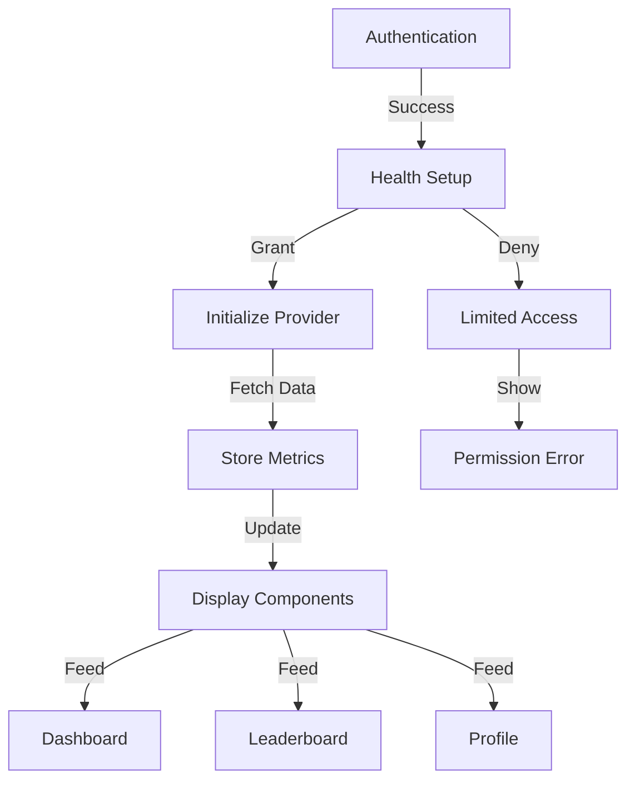

# Health Permissions Flow Integration

## Context

We need to ensure a seamless flow from user authentication through health permissions to metric display, connecting:
- Authentication ((auth) directory)
- Health permission onboarding ((onboarding) directory)
- Metric display components (MetricCard.tsx, Dashboard.tsx)
- Leaderboard integration (LeaderboardEntry.tsx)
- Profile display (Profile.tsx)

## Decision

We will implement a coordinated flow that manages health permissions and data access across components.

### 1. Flow Diagram



### 2. Component Integration

```typescript
// Health Permission State Management
interface HealthState {
  permissionStatus: PermissionStatus;
  lastSync: Date | null;
  metrics: HealthMetrics | null;
  error: Error | null;
}

// Unified Health Context
interface HealthContext extends HealthState {
  requestPermissions: () => Promise<void>;
  refreshMetrics: () => Promise<void>;
  hasRequiredPermissions: () => boolean;
}
```

### 3. Data Flow Implementation

1. **Auth to Onboarding**
```typescript
// In AuthProvider
async function completeAuth(user: User) {
  // After successful auth
  const permissionStatus = await checkHealthPermissions();
  
  if (permissionStatus === 'not_determined') {
    router.replace('/(onboarding)/health-setup');
  } else if (permissionStatus === 'granted') {
    router.replace('/(app)/(home)');
  } else {
    // Handle denied state
    router.replace('/(onboarding)/health-setup?error=denied');
  }
}
```

2. **Health Setup to Metrics**
```typescript
// In health-setup.tsx
async function handlePermissionGrant() {
  const provider = HealthProviderFactory.getProvider();
  await provider.initialize();
  
  // Request permissions
  const status = await provider.requestPermissions();
  
  if (status === 'granted') {
    // Initialize metrics
    await initializeMetrics();
    router.replace('/(app)/(home)');
  } else {
    setError('Permission required for full functionality');
  }
}
```

3. **Metrics to Display**
```typescript
// In MetricCard.tsx
function MetricCard({ type }: { type: MetricType }) {
  const { metrics, error, refreshMetrics } = useHealth();
  const { healthPermissionStatus } = useAuth();

  if (healthPermissionStatus !== 'granted') {
    return <PermissionErrorView onRetry={requestPermissions} />;
  }

  return (
    <Card>
      <MetricDisplay value={metrics?.[type]} />
      <RefreshButton onPress={refreshMetrics} />
    </Card>
  );
}
```

### 4. Permission States

```typescript
// Permission state handling
const PermissionStates = {
  NOT_DETERMINED: {
    canAccess: false,
    requiresSetup: true,
    message: 'Health permissions required'
  },
  GRANTED: {
    canAccess: true,
    requiresSetup: false,
    message: null
  },
  DENIED: {
    canAccess: false,
    requiresSetup: false,
    message: 'Please enable health access in settings'
  }
} as const;
```

### 5. Component Access Control

```typescript
// Higher-order component for permission checks
function withHealthPermissions<P extends object>(
  WrappedComponent: React.ComponentType<P>
) {
  return function HealthPermissionGuard(props: P) {
    const { healthPermissionStatus } = useAuth();
    const state = PermissionStates[healthPermissionStatus];

    if (!state.canAccess) {
      return (
        <PermissionErrorView
          message={state.message}
          showSetup={state.requiresSetup}
        />
      );
    }

    return <WrappedComponent {...props} />;
  };
}
```

### 6. Error Recovery

```typescript
// Permission error handling
async function handlePermissionError(error: Error) {
  if (error instanceof HealthProviderError) {
    switch (error.code) {
      case 'permission_denied':
        return router.replace('/(onboarding)/health-setup');
      case 'provider_error':
        return showRetryDialog();
      default:
        return logError(error);
    }
  }
}
```

## Implementation Steps

1. **Authentication Integration**
   - Update auth flow to check permission status
   - Add permission state to auth context
   - Handle permission-based routing

2. **Health Setup Enhancement**
   - Implement permission request flow
   - Add error handling and retry logic
   - Create setup completion tracking

3. **Metrics Integration**
   - Connect health provider to metrics
   - Implement data refresh logic
   - Add error boundaries

4. **Display Components**
   - Add permission checks to components
   - Implement error states
   - Create loading indicators

## Consequences

### Positive
- Clear permission flow
- Consistent error handling
- Seamless data integration
- Graceful degradation

### Negative
- Additional routing complexity
- Permission state management
- Multiple error states
- Setup requirements

## Status

Proposed

## References

- [HealthKit Authorization](https://developer.apple.com/documentation/healthkit/authorizing_access_to_health_data)
- [Google Fit Permissions](https://developers.google.com/fit/android/authorization)