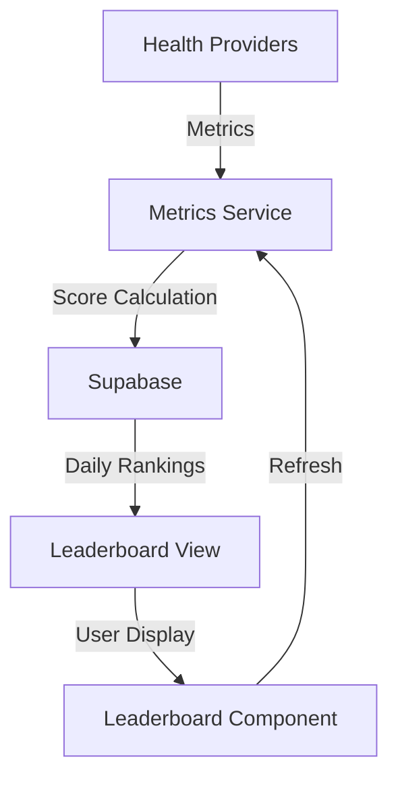

# Leaderboard Implementation Strategy

## Context

The application needs to display a leaderboard that compares users' health metrics and scores, while respecting privacy settings and ensuring efficient data access.

## Decision

We will implement a leaderboard system that focuses on daily rankings and user privacy.

### 1. Data Structure

```sql
-- View for daily leaderboard
CREATE VIEW daily_leaderboard AS
SELECT 
  hm.user_id,
  up.display_name,
  hm.date,
  hm.steps,
  hm.distance,
  hm.calories,
  hm.heart_rate,
  hm.daily_score,
  RANK() OVER (PARTITION BY hm.date ORDER BY hm.daily_score DESC) as rank
FROM health_metrics hm
JOIN user_profiles up ON hm.user_id = up.id
WHERE up.show_profile = true
  OR hm.user_id = auth.uid();
```

### 2. Core Components

```typescript
interface LeaderboardEntry {
  user_id: string;
  display_name: string | null;
  date: string;
  metrics: {
    steps: number | null;
    distance: number | null;
    calories: number | null;
    heart_rate: number | null;
  };
  daily_score: number;
  rank: number;
  is_current_user: boolean;
}

interface LeaderboardState {
  entries: LeaderboardEntry[];
  lastUpdated: Date;
  userRank: number | null;
  totalParticipants: number;
}
```

### 3. Data Flow



### 4. Implementation Strategy

1. **Leaderboard Service**
```typescript
class LeaderboardService {
  // Fetch daily leaderboard
  async getDailyLeaderboard(date: string): Promise<LeaderboardState> {
    const { data, error } = await supabase
      .from('daily_leaderboard')
      .select('*')
      .eq('date', date)
      .order('rank', { ascending: true });
      
    if (error) throw error;
    
    return this.processLeaderboardData(data);
  }

  // Update user metrics and recalculate score
  async updateUserMetrics(
    userId: string,
    metrics: HealthMetrics
  ): Promise<void> {
    const score = calculateDailyScore(metrics);
    
    await supabase
      .from('health_metrics')
      .upsert({
        user_id: userId,
        date: metrics.date,
        ...metrics,
        daily_score: score
      });
  }
}
```

2. **Privacy Management**
```typescript
interface PrivacySettings {
  show_profile: boolean;
  share_metrics: {
    steps: boolean;
    distance: boolean;
    calories: boolean;
    heart_rate: boolean;
  };
}

async function updatePrivacySettings(
  userId: string,
  settings: PrivacySettings
): Promise<void> {
  await supabase
    .from('user_profiles')
    .update({
      show_profile: settings.show_profile,
      metric_sharing: settings.share_metrics
    })
    .eq('id', userId);
}
```

3. **Refresh Strategy**
```typescript
function useLeaderboard() {
  const [state, setState] = useState<LeaderboardState | null>(null);
  const [loading, setLoading] = useState(true);
  
  // Auto-refresh every 5 minutes
  useEffect(() => {
    const interval = setInterval(refreshLeaderboard, 5 * 60 * 1000);
    return () => clearInterval(interval);
  }, []);
  
  // Pull-to-refresh functionality
  const handleRefresh = async () => {
    setLoading(true);
    try {
      const data = await leaderboardService.getDailyLeaderboard(
        new Date().toISOString().split('T')[0]
      );
      setState(data);
    } finally {
      setLoading(false);
    }
  };
  
  return { state, loading, refresh: handleRefresh };
}
```

### 5. Performance Considerations

1. **Data Loading**
- Paginate leaderboard entries
- Cache results locally
- Background refresh
- Optimistic updates

2. **Score Updates**
- Batch metric updates
- Debounce score calculations
- Background processing

### 6. Security Rules

```sql
-- Ensure users can only see allowed profiles
CREATE POLICY "Leaderboard visibility"
  ON daily_leaderboard
  FOR SELECT
  USING (
    show_profile = true 
    OR user_id = auth.uid()
  );

-- Protect metric updates
CREATE POLICY "Users can only update their own metrics"
  ON health_metrics
  FOR UPDATE
  USING (auth.uid() = user_id);
```

## Implementation Steps

1. **Database Setup**
- Create leaderboard view
- Set up security policies
- Add necessary indexes

2. **Service Layer**
- Implement LeaderboardService
- Add metric update logic
- Create privacy controls

3. **UI Components**
- Build LeaderboardEntry component
- Add pull-to-refresh
- Implement error states

4. **Testing**
- Test privacy rules
- Verify score calculations
- Check update performance

## Consequences

### Positive
- Clear privacy controls
- Efficient data access
- Real-time updates
- Scalable structure

### Negative
- Complex SQL view
- Regular refresh needed
- Privacy rule overhead
- Cache management

## Status

Proposed

## References

- [Supabase Performance Best Practices](https://supabase.com/docs/guides/database/timeouts)
- [React Native List Performance](https://reactnative.dev/docs/optimizing-flatlist-configuration)