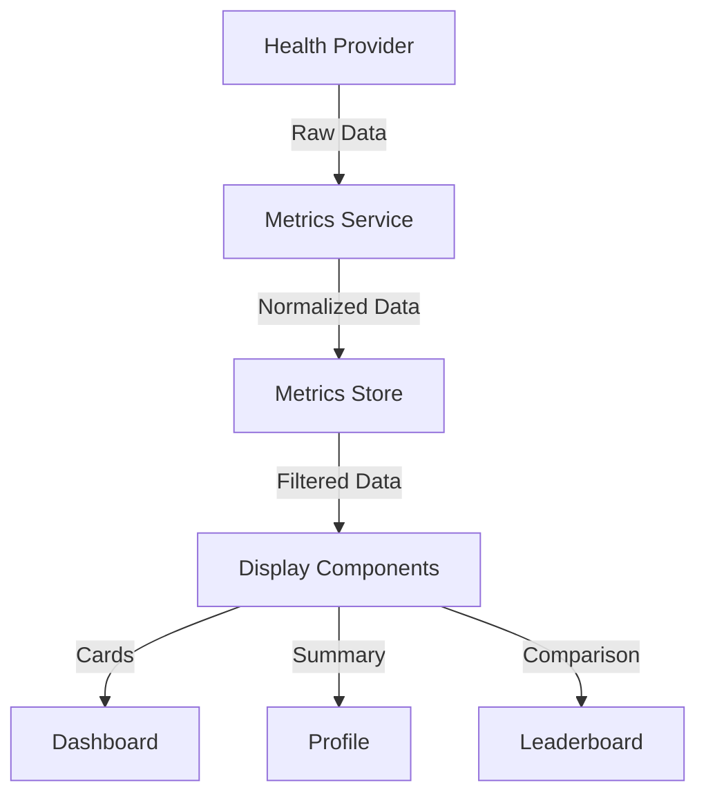

ww# Metrics Display Architecture

## Context

We need to efficiently display health metrics across multiple components (MetricCard, Dashboard, LeaderboardEntry, Profile) while maintaining consistency and handling permission states.

## Decision

We will implement a centralized metrics management system with component-specific display adapters.

### 1. Architecture Overview



### 2. Data Flow Structure

```typescript
// Core metrics types
interface MetricData {
  value: number;
  unit: string;
  timestamp: string;
  source: string;
}

interface DisplayMetric {
  current: MetricData;
  previous?: MetricData;
  goal?: number;
  progress: number;
  trend: 'up' | 'down' | 'stable';
}

// Component-specific adapters
interface MetricCardProps {
  metric: DisplayMetric;
  type: MetricType;
  showComparison: boolean;
}

interface DashboardMetrics {
  daily: Record<MetricType, DisplayMetric>;
  weekly: Record<MetricType, DisplayMetric[]>;
  goals: Record<MetricType, number>;
}

interface LeaderboardMetrics {
  score: number;
  highlights: Partial<Record<MetricType, DisplayMetric>>;
  rank: number;
}
```

### 3. Component Implementation

1. **MetricCard Component**
```typescript
// Base metric display component
function MetricCard({ metric, type, showComparison }: MetricCardProps) {
  const { permissionStatus } = useHealth();
  
  if (permissionStatus !== 'granted') {
    return <PermissionRequired type={type} />;
  }

  return (
    <Card>
      <Value value={metric.current.value} unit={metric.current.unit} />
      {showComparison && (
        <Comparison
          current={metric.current}
          previous={metric.previous}
          trend={metric.trend}
        />
      )}
      <Progress value={metric.progress} goal={metric.goal} />
    </Card>
  );
}
```

2. **Dashboard Integration**
```typescript
// Dashboard metrics composition
function Dashboard() {
  const { metrics } = useDashboardMetrics();
  
  return (
    <View>
      <DailyOverview metrics={metrics.daily} />
      <WeeklyTrends data={metrics.weekly} />
      <GoalProgress current={metrics.daily} goals={metrics.goals} />
    </View>
  );
}
```

3. **Leaderboard Integration**
```typescript
// Leaderboard entry with metrics
function LeaderboardEntry({ userId, metrics }: LeaderboardEntryProps) {
  return (
    <View>
      <Score value={metrics.score} rank={metrics.rank} />
      <HighlightMetrics
        metrics={metrics.highlights}
        layout="compact"
      />
    </View>
  );
}
```

### 4. Data Management

1. **Metrics Store**
```typescript
class MetricsStore {
  private cache: Map<string, MetricData>;
  private subscribers: Set<(metrics: MetricData) => void>;

  // Update metrics with new data
  async update(newMetrics: MetricData[]) {
    for (const metric of newMetrics) {
      this.cache.set(this.getCacheKey(metric), metric);
    }
    this.notifySubscribers();
  }

  // Get metrics for specific component
  getMetricsForDisplay(
    type: MetricType,
    timeframe: TimeFrame
  ): DisplayMetric {
    const data = this.getFromCache(type, timeframe);
    return this.formatForDisplay(data);
  }
}
```

2. **Update Cycle**
```typescript
// Metrics update management
class MetricsUpdateManager {
  private updateInterval: number = 5 * 60 * 1000; // 5 minutes

  async startUpdateCycle() {
    await this.updateMetrics();
    
    setInterval(async () => {
      await this.updateMetrics();
    }, this.updateInterval);
  }

  private async updateMetrics() {
    const provider = HealthProviderFactory.getProvider();
    const metrics = await provider.getMetrics();
    await this.store.update(metrics);
  }
}
```

### 5. Performance Optimization

```typescript
// Metric memoization
const useMemoizedMetrics = (metrics: MetricData[], deps: any[]) => {
  return useMemo(() => {
    return metrics.map(metric => ({
      ...metric,
      formattedValue: formatMetricValue(metric),
      trend: calculateTrend(metric)
    }));
  }, deps);
};

// Lazy loading components
const MetricChart = lazy(() => import('./MetricChart'));
const WeeklyTrends = lazy(() => import('./WeeklyTrends'));
```

### 6. Error Handling

```typescript
// Metric error boundaries
class MetricErrorBoundary extends React.Component {
  state = { hasError: false };

  static getDerivedStateFromError(error: Error) {
    return { hasError: true };
  }

  render() {
    if (this.state.hasError) {
      return <MetricErrorView onRetry={this.resetError} />;
    }
    return this.props.children;
  }
}
```

## Implementation Steps

1. **Core Components**
   - Implement base MetricCard
   - Create Dashboard layout
   - Build LeaderboardEntry

2. **Data Management**
   - Set up MetricsStore
   - Implement update cycle
   - Add caching layer

3. **Display Logic**
   - Add formatting utilities
   - Implement comparisons
   - Create trend calculations

4. **Optimization**
   - Add memoization
   - Implement lazy loading
   - Optimize re-renders

## Consequences

### Positive
- Consistent metric display
- Efficient updates
- Reusable components
- Clear data flow

### Negative
- Complex state management
- Multiple data transformations
- Cache invalidation concerns
- Update cycle complexity

## Status

Proposed

## References

- [React Performance](https://reactjs.org/docs/optimizing-performance.html)
- [Data Visualization Best Practices](https://www.nngroup.com/articles/data-visualization-best-practices/)