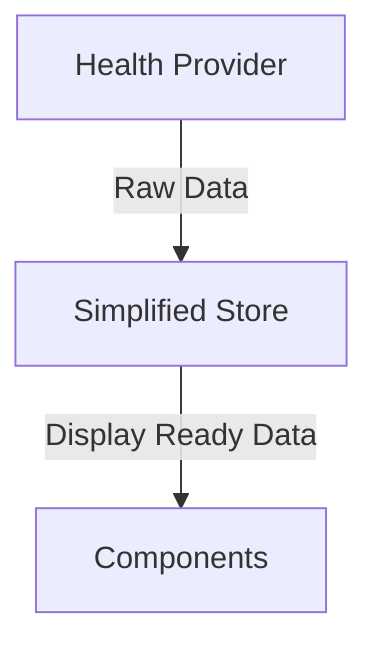

# Metrics System Redesign

## Context

The current metrics system implementation has grown complex with multiple layers of abstraction, caching, and data transformation. This complexity impacts performance and maintainability.

## Decision

We will redesign the metrics system to be simpler and more performant while maintaining functionality.

### 1. Simplified Data Flow



### 2. Core Changes

1. **Simplified MetricsStore**
```typescript
interface SimpleMetricsStore {
  // Single source of truth
  metrics: Record<MetricType, {
    value: number;
    timestamp: string;
    goal: number;
  }>;
  
  // Simple update method
  update(type: MetricType, value: number): void;
  
  // Get formatted metrics
  getDisplayMetrics(): DisplayMetric[];
}
```

2. **Flattened Component Hierarchy**
```typescript
// Before
Dashboard -> MetricCardList -> MetricCard -> MetricDisplay

// After
Dashboard -> MetricCard[]
```

3. **Streamlined Types**
```typescript
interface MetricConfig {
  type: MetricType;
  title: string;
  icon: string;
  defaultGoal: number;
  unit: string;
  formatValue: (value: number) => string;
}

interface DisplayMetric {
  type: MetricType;
  value: number;
  goal: number;
  progress: number;
  formattedValue: string;
}
```

### 3. Implementation Guidelines

1. **File Structure**
```
src/
  components/
    metrics/
      Dashboard.tsx       # Main container component
      MetricCard.tsx     # Individual metric display
      types.ts           # Simplified type definitions
  providers/
    health/
      store/
        SimpleMetricsStore.ts  # New simplified store
      types/
        metrics.ts      # Core metric types
```

2. **SimpleMetricsStore Implementation**
```typescript
// SimpleMetricsStore.ts
export class SimpleMetricsStore {
  private metrics: Record<MetricType, MetricData> = {};

  update(type: MetricType, value: number) {
    this.metrics[type] = {
      value,
      timestamp: new Date().toISOString(),
      goal: healthMetrics[type].defaultGoal
    };
  }

  getDisplayMetrics(): DisplayMetric[] {
    return Object.entries(this.metrics).map(([type, data]) => ({
      type: type as MetricType,
      value: data.value,
      goal: data.goal,
      progress: Math.min(data.value / data.goal, 1),
      formattedValue: healthMetrics[type].formatValue(data.value)
    }));
  }
}
```

3. **Dashboard Component Structure**
```typescript
// Dashboard.tsx
function Dashboard({ userId }: { userId: string }) {
  const metrics = useMetrics(userId);
  
  return (
    <View>
      <Header />
      <MetricGrid>
        {metrics.map(metric => (
          <MetricCard
            key={metric.type}
            metric={metric}
            config={healthMetrics[metric.type]}
          />
        ))}
      </MetricGrid>
    </View>
  );
}
```

4. **MetricCard Component**
```typescript
// MetricCard.tsx
const MetricCard = React.memo(function MetricCard({
  metric,
  config
}: {
  metric: DisplayMetric;
  config: MetricConfig;
}) {
  return (
    <Surface>
      <Value value={metric.formattedValue} unit={config.unit} />
      <Progress value={metric.progress} />
    </Surface>
  );
});
```

### 4. Migration Steps

1. **Phase 1: Store Implementation**
- Create SimpleMetricsStore.ts
- Implement core functionality
- Add type definitions
- Write unit tests

2. **Phase 2: Component Updates**
- Create new Dashboard component
- Implement MetricCard
- Add proper memoization
- Test rendering performance

3. **Phase 3: Integration**
- Connect store to health provider
- Update existing components to use new store
- Validate data flow
- Performance testing

4. **Phase 4: Cleanup**
- Remove old store implementation
- Clean up unused components
- Update documentation
- Final testing

## Performance Considerations

1. **Rendering Optimization**
- Use React.memo for MetricCard
- Implement useMemo for expensive calculations
- Avoid unnecessary re-renders
- Profile component updates

2. **Data Management**
- Single source of truth
- Minimal data transformations
- Efficient updates
- Clear update boundaries

3. **Animation Performance**
- Use native driver when possible
- Optimize animation timing
- Reduce animation complexity
- Profile animation impact

## Testing Strategy

1. **Unit Tests**
- Store functionality
- Data transformations
- Component rendering
- Animation behavior

2. **Integration Tests**
- Data flow
- Component interaction
- Store updates
- Error handling

3. **Performance Tests**
- Render timing
- Update cycles
- Memory usage
- Animation smoothness

## Status

Proposed

## Consequences

### Positive
- Simpler, more maintainable code
- Better performance
- Easier debugging
- Clearer data flow

### Negative
- Migration effort required
- Potential temporary disruption
- Need to update tests
- Learning curve for new patterns

## References

- Current implementation in src/components/metrics/
- React Native Paper documentation
- React performance best practices
- Original metrics architecture ADR