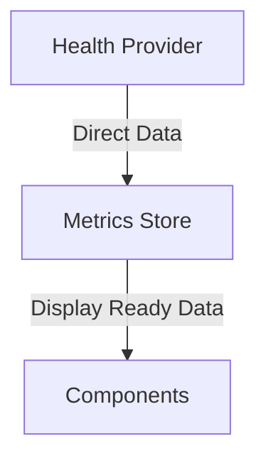
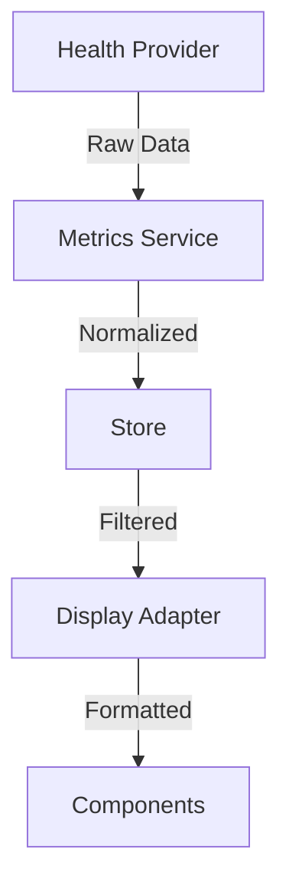

# Metrics System Simplification

## Context

After reviewing the current metrics system implementation, we've identified several areas where architectural complexity may be impacting rendering performance:

1. Overly complex data transformation pipeline
2. Multiple caching layers
3. Frequent permission checks
4. Complex component hierarchy

## Analysis

### Current Pain Points

1. **Data Flow Complexity**
   - Raw → Normalized → Filtered → Display transformations
   - Multiple cache layers (AsyncStorage, in-memory)
   - Complex update cycles (5-minute intervals)
   - Redundant permission checks

2. **Component Architecture Issues**
   - Deep component nesting
   - Prop drilling through multiple levels
   - Complex animation states
   - Heavy reliance on context

3. **Performance Bottlenecks**
   - Frequent re-renders due to nested state updates
   - Redundant data transformations
   - Unnecessary permission checks
   - Complex caching logic

## Proposed Simplifications

### 1. Streamlined Data Flow



Instead of:


### 2. Simplified Component Structure

```typescript
// Before
Dashboard -> MetricCardList -> MetricCard -> MetricDisplay -> MetricValue

// After
Dashboard -> MetricCard (with direct data access)
```

### 3. Optimized Data Management

```typescript
interface SimplifiedMetricStore {
  // Single source of truth
  metrics: Record<MetricType, DisplayMetric>;
  
  // Direct updates
  update(type: MetricType, value: number): void;
  
  // Simple subscription
  subscribe(callback: (metrics: DisplayMetric) => void): () => void;
}
```

### 4. Reduced Permission Complexity

```typescript
// Before
const permissionFlow = {
  checkOnMount: true,
  checkOnFocus: true,
  checkOnSync: true,
  checkOnUpdate: true
};

// After
const simplifiedPermissions = {
  checkOnMount: true,
  checkOnError: true
};
```

## Implementation Changes

1. **Flatten Component Hierarchy**
   - Remove unnecessary wrapper components
   - Reduce context usage
   - Implement direct data access

2. **Simplify State Management**
   - Single source of truth for metrics
   - Remove redundant caching layers
   - Simplify update cycles

3. **Optimize Rendering**
   - Use memo and useMemo strategically
   - Implement proper shouldComponentUpdate
   - Reduce animation complexity

4. **Streamline Data Flow**
   - Direct data transformations
   - Remove unnecessary abstraction layers
   - Simplify permission checks

## Migration Strategy

1. **Phase 1: Component Simplification**
   - Flatten component hierarchy
   - Remove unnecessary wrappers
   - Consolidate styling

2. **Phase 2: Data Management**
   - Implement simplified store
   - Remove redundant caching
   - Streamline updates

3. **Phase 3: Performance Optimization**
   - Add strategic memoization
   - Optimize re-renders
   - Profile and tune

## Expected Benefits

1. **Performance**
   - Faster initial render
   - Reduced re-render frequency
   - Better memory usage
   - Smoother animations

2. **Development**
   - Simpler debugging
   - Easier maintenance
   - Better code clarity
   - Reduced complexity

3. **User Experience**
   - More responsive UI
   - Consistent updates
   - Reduced jank
   - Better reliability

## Risks and Mitigations

### Risks
1. Data consistency during migration
2. Temporary performance regression
3. Feature regression
4. User experience disruption

### Mitigations
1. Phased rollout
2. Comprehensive testing
3. Performance monitoring
4. Feature parity validation

## Status

Proposed

## References

- Current implementation in src/components/metrics/
- Performance profiling results
- React Native best practices
- Original metrics architecture ADR