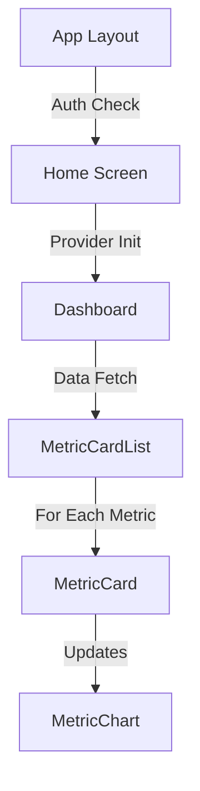

# Rendering Optimization Strategy

## Context

Analysis of the app directory structure and component implementation reveals several performance bottlenecks in the rendering pipeline, particularly in metric display components.

## Current Issues

### 1. Rendering Bottlenecks



1. **Redundant Auth Checks**
   - Layout level check
   - Screen level check
   - Component level check

2. **Provider Initialization**
   - New provider instance on each render
   - Multiple initialization points
   - Redundant setup

3. **Data Transformation**
   - Heavy calculations in render cycle
   - Unnecessary data normalization
   - Frequent re-renders

### 2. Component-Specific Issues

#### MetricDetailScreen ([metric].tsx)
```typescript
// Current Implementation
const mockHistoricalData = useMemo(() => {
  // Heavy data generation on each metric/user change
  // Causes unnecessary re-renders
}, [user?.id, metric, metrics]);

// Proposed Solution
const mockHistoricalData = useStableHistoricalData({
  userId: user?.id,
  metric,
  currentValue: metrics?.[metric]
});
```

#### HomeScreen (index.tsx)
```typescript
// Current Implementation
const provider = useMemo(() => HealthProviderFactory.getProvider(), []);

// Proposed Solution
const provider = useHealthProvider(); // Singleton pattern
```

## Optimization Strategy

### 1. Component Rendering

```typescript
// Implement stable component updates
const StableMetricCard = memo(MetricCard, (prev, next) => {
  return (
    prev.value === next.value &&
    prev.goal === next.goal &&
    prev.progress === next.progress
  );
});

// Optimize list rendering
const MetricCardList = memo(function MetricCardList({ metrics }) {
  return (
    <View>
      {Object.entries(metrics).map(([type, data]) => (
        <StableMetricCard
          key={type}
          type={type}
          {...data}
        />
      ))}
    </View>
  );
});
```

### 2. Data Management

```typescript
// Implement stable data hooks
function useStableMetrics(provider, userId) {
  return useMemo(
    () => ({
      getData: () => provider.getMetrics(userId),
      subscribe: (callback) => provider.subscribe(userId, callback)
    }),
    [provider, userId]
  );
}

// Optimize updates
const useMetricUpdates = (metrics) => {
  const prevMetrics = useRef(metrics);
  
  return useMemo(() => {
    const changes = getMetricChanges(prevMetrics.current, metrics);
    prevMetrics.current = metrics;
    return changes;
  }, [metrics]);
};
```

### 3. Layout Optimization

```typescript
// Implement layout stability
const StableLayout = memo(function StableLayout({ children }) {
  return (
    <View style={styles.container}>
      <View style={styles.content}>{children}</View>
    </View>
  );
});

// Optimize style calculations
const styles = StyleSheet.create({
  container: {
    flex: 1,
    backgroundColor: theme.colors.background
  },
  content: {
    flex: 1,
    paddingHorizontal: theme.spacing.md
  }
});
```

## Implementation Steps

1. **Immediate Optimizations**
   - Implement component memoization
   - Optimize data transformations
   - Reduce style calculations

2. **Data Flow Improvements**
   - Implement stable data hooks
   - Optimize update cycles
   - Add change detection

3. **Layout Enhancements**
   - Optimize layout structure
   - Implement stable layouts
   - Reduce re-renders

## Expected Benefits

1. **Performance**
   - Reduced initial render time
   - Fewer re-renders
   - Better memory usage
   - Smoother animations

2. **Development**
   - Clearer update patterns
   - Better debugging
   - Predictable renders
   - Easier maintenance

## Monitoring and Metrics

1. **Key Metrics**
   - Time to first render
   - Re-render frequency
   - Memory usage
   - Frame rate

2. **Monitoring Tools**
   - React DevTools
   - Performance Monitor
   - Memory Profiler
   - Frame Rate Monitor

## Status

Proposed

## References

- React Native Performance Documentation
- Expo Router Best Practices
- React Profiler Documentation