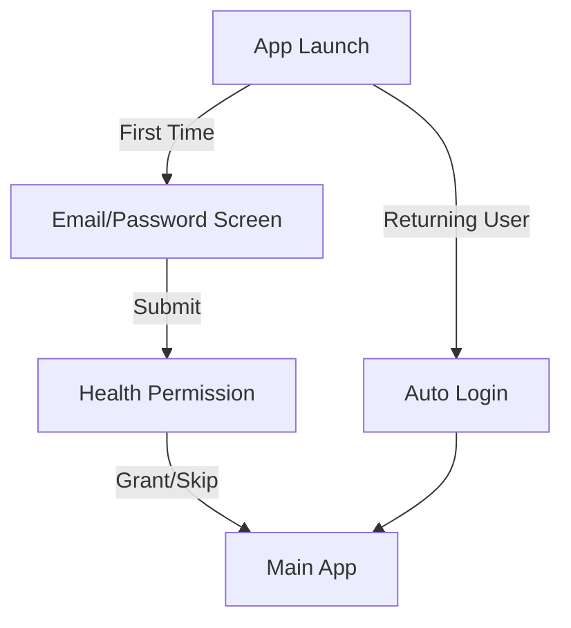

# Streamlined Authentication Flow

## Context

We need a minimalist authentication and onboarding flow that prioritizes getting users into the app quickly while maintaining security best practices.

## Decision

We will implement a simplified three-step authentication flow with progressive profile completion.

### 1. Core Flow



### 2. Minimalist Data Structure

```sql
-- Only essential fields in user_profiles
CREATE TABLE user_profiles (
  id UUID PRIMARY KEY REFERENCES auth.users,
  display_name TEXT,
  health_status TEXT DEFAULT 'pending',
  created_at TIMESTAMPTZ DEFAULT now(),
  CONSTRAINT valid_health_status CHECK (health_status IN ('pending', 'granted', 'denied'))
);

-- Automatic profile creation
CREATE FUNCTION create_profile_for_new_user()
RETURNS TRIGGER AS $$
BEGIN
  INSERT INTO public.user_profiles (id)
  VALUES (new.id);
  RETURN new;
END;
$$ LANGUAGE plpgsql SECURITY DEFINER;

CREATE TRIGGER on_auth_user_created
  AFTER INSERT ON auth.users
  FOR EACH ROW EXECUTE FUNCTION create_profile_for_new_user();
```

### 3. Implementation Strategy

1. **One-Screen Authentication**
```typescript
interface AuthScreen {
  // Single screen for both login and register
  mode: 'login' | 'register';
  email: string;
  password: string;
  isLoading: boolean;
}

// Simple validation
const validateInput = (email: string, password: string): boolean => {
  return email.includes('@') && password.length >= 6;
};
```

2. **Simplified Health Setup**
```typescript
interface HealthSetup {
  // Quick health permission request
  requestPermissions(): Promise<void>;
  skipSetup(): Promise<void>;
}

// Minimal permission handling
const handleHealthSetup = async () => {
  try {
    const status = await requestPermissions();
    await updateProfile({ health_status: status });
    router.replace('/(app)');
  } catch {
    // Always allow proceeding even if permissions fail
    router.replace('/(app)');
  }
};
```

3. **Progressive Profile Enhancement**
```typescript
interface ProfileCompletion {
  required: {
    email: string;
    password: string;
  };
  optional: {
    display_name?: string;
    avatar_url?: string;
    preferences?: UserPreferences;
  };
}
```

### 4. Security Measures

1. **Essential Security**
```typescript
const securityMeasures = {
  // Core security features only
  passwordMinLength: 6,
  rateLimiting: true,
  sessionTimeout: 30 * 24 * 60 * 60, // 30 days
  secureStorage: true
};
```

2. **Simplified Permissions**
```sql
-- Minimal RLS policies
ALTER TABLE user_profiles ENABLE ROW LEVEL SECURITY;

CREATE POLICY "Users can read own profile"
  ON user_profiles FOR SELECT
  USING (auth.uid() = id);

CREATE POLICY "Users can update own profile"
  ON user_profiles FOR UPDATE
  USING (auth.uid() = id);
```

### 5. User Experience

1. **Quick Start**
- Single screen for auth
- Minimal required fields
- Optional health setup
- Immediate app access

2. **Progressive Enhancement**
- Basic profile first
- Optional details later
- Non-blocking health setup
- Gradual feature introduction

### 6. Error Handling

```typescript
const handleAuthError = (error: AuthError): string => {
  // Simple error messages
  switch (error.code) {
    case 'invalid_email':
      return 'Please enter a valid email';
    case 'invalid_password':
      return 'Password must be at least 6 characters';
    default:
      return 'Unable to sign in. Please try again.';
  }
};
```

## Implementation Steps

1. **Initial Setup**
- Create minimal database schema
- Set up basic auth triggers
- Implement core security

2. **Auth Flow**
- Build single auth screen
- Add health permission request
- Create simple routing

3. **Profile Management**
- Implement basic profile
- Add optional fields
- Set up progressive completion

## Consequences

### Positive
- Quick user onboarding
- Reduced friction
- Clear user flow
- Maintainable codebase

### Negative
- Limited initial user data
- Delayed feature access
- Basic profile information
- Simple security model

## Status

Proposed

## References

- [Supabase Auth Best Practices](https://supabase.com/docs/guides/auth/auth-helpers)
- [React Native Performance](https://reactnative.dev/docs/performance)